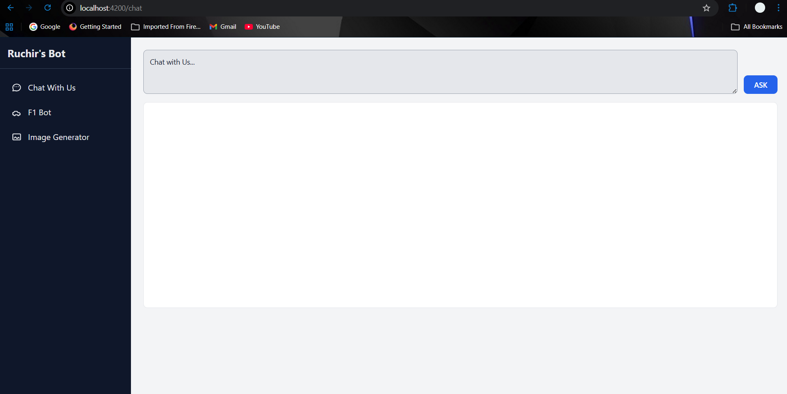
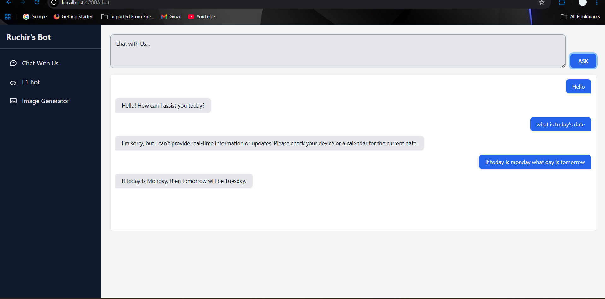
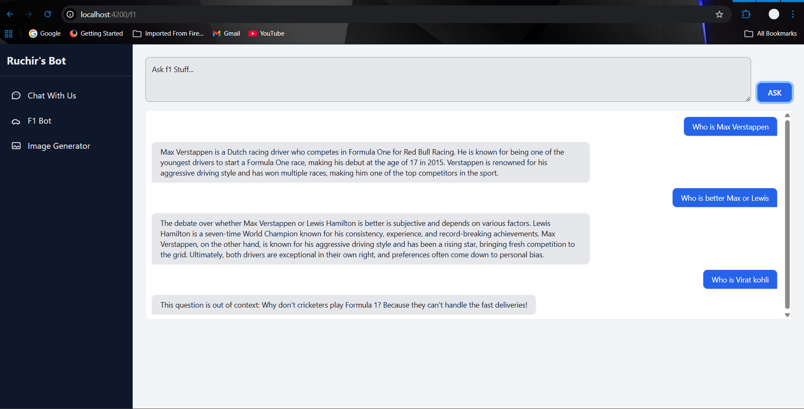
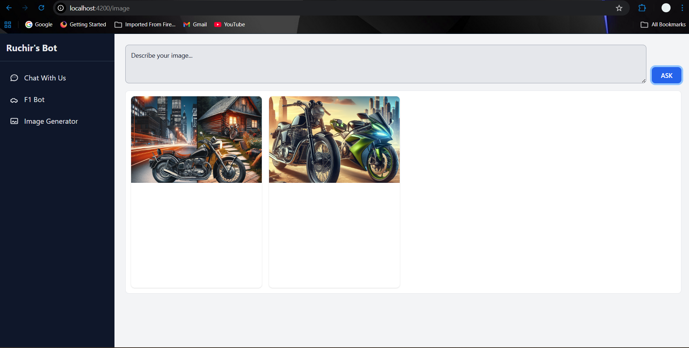

# 🚀 Spring AI Full Stack Project

## 📌 Overview
This project is a backend application built using **Spring Boot** and **AI capabilities** powered by Spring AI. It provides APIs for General interaction, Asking F1 specific stuff and Generating images based on the description provided.

The backend is designed to seamlessly integrate with a frontend application (Build using Angular) to deliver a complete AI-powered user experience.

---

## 🧠 What is Spring AI?
Spring AI is a framework that simplifies integrating AI models (like OpenAI, AWS Bedrock, etc.) into Spring Boot applications. It allows developers to:
- Build AI-powered APIs easily  
- Handle prompts and responses efficiently  
- Integrate LLMs into real-world applications  

---

## ⚙️ Features
- 🤖 AI-powered API endpoints  
- 🔄 Dynamic response generation  
- 📡 RESTful API architecture  
- 🧩 Easy integration with frontend apps  
- 🗂️ Clean and modular code structure  

---

## 🏗️ Tech Stack (Backend)
- **Java 8+**
- **Spring Boot**
- **Spring AI**
- **REST APIs**

## 🏗️ Tech Stack (Frontend)
- **Angular**
- **Tailwind CSS**

---

## 🔗 Frontend Repository
👉 You can find the frontend for this project here:  
🔗 **Frontend GitHub Repo:** [https://github.com/RuchirDixit/AI_Bot_Frontend](https://github.com/RuchirDixit/AI_Bot_Frontend)

---

## 📸 Screenshots

### 🤖 Home Page

### 🤖 General Chat Page

### 🤖 F1 Chat Page

### 🤖 Image Generation Page

---

## 🚀 Getting Started

### 🔧 Prerequisites
- Java 8 or higher  
- Maven  
- IDE (IntelliJ and VS Code)  

---
